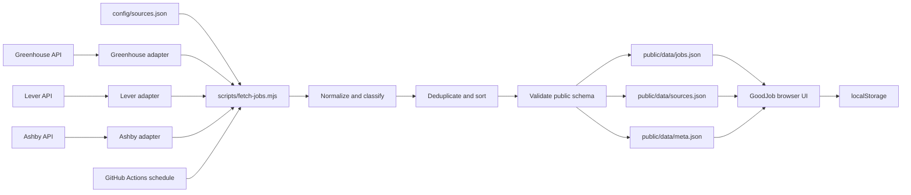

# GoodJob

[](https://frankstop.github.io/GoodJob/)
[](https://github.com/frankstop/GoodJob/actions/workflows/checks.yml)
[](https://github.com/frankstop/GoodJob/actions/workflows/refresh-jobs.yml)

GoodJob is a static technical job dashboard backed by employer-direct applicant tracking system feeds. It gives job seekers one place to search, compare, age, sort, and save listings without creating an account or sending personal activity to a server.

The project combines a scheduled Node.js data pipeline with a dependency-free browser application. Greenhouse, Lever, and Ashby listings are normalized into one public contract, committed to the repository, and served through GitHub Pages.

[Open the live dashboard](https://frankstop.github.io/GoodJob/)

## Project goals

Job listings from employer career sites use different field names, date formats, salary structures, and location conventions. A useful dashboard needs consistent records without replacing the employer as the source of truth.

GoodJob is designed to:

- collect jobs from public employer ATS endpoints
- preserve canonical employer application links and source metadata
- present one predictable schema to the browser
- continue refreshing when one employer feed is unavailable
- keep filters, saved jobs, and browsing state on the user's device
- run as a static GitHub Pages project with no database or application server

The dashboard is aimed at software engineering, data, infrastructure, IT support, technical operations, business systems, product, security, and QA roles. The starter source list favors employers with relevant US, New York, hybrid, or remote opportunities.

## System architecture



The architecture has two boundaries:

1. The data pipeline converts provider-specific responses into versioned public files.
2. The browser reads those files and manages user state locally.

The browser never calls employer APIs directly. This keeps the user experience independent from cross-origin rules, provider latency, and temporary feed failures.

## Data flow

### 1. Source configuration

`config/sources.json` is the pipeline's source of truth. Each record identifies the employer, adapter, public endpoint, source tags, and career homepage.

```json
{
  "id": "company_greenhouse",
  "name": "Company Name",
  "adapter": "greenhouse",
  "url": "https://boards-api.greenhouse.io/v1/boards/company/jobs?content=true",
  "enabled": true,
  "tags": ["Software", "Data"],
  "homepage": "https://company.com/careers"
}
```

The committed starter configuration contains 12 reviewed employers across all three supported adapters.

### 2. Fetch and adapter isolation

`scripts/fetch-jobs.mjs` fetches enabled sources concurrently with a 30-second request timeout and retry handling. Each adapter translates its provider's response:

| Adapter | Public API | Primary provider fields |
| --- | --- | --- |
| Greenhouse | Job Board API | `id`, `title`, `location`, `offices`, `departments`, `content`, `absolute_url`, `updated_at` |
| Lever | Postings API | `id`, `text`, `categories`, `workplaceType`, `descriptionPlain`, `hostedUrl`, `createdAt` |
| Ashby | Job Posting API | `id`, `title`, `location`, `department`, `employmentType`, `descriptionHtml`, `jobUrl`, `publishedAt` |

Adapter failures are contained per source. A failed source produces an error record in `public/data/sources.json`; successful sources continue through the pipeline.

### 3. Normalization

Every accepted listing is converted to the GoodJob contract:

```json
{
  "id": "job-0123456789abcdefabcd",
  "externalId": "1234567",
  "title": "Business Systems Analyst",
  "company": "Company Name",
  "location": "New York, NY",
  "workMode": "Hybrid",
  "employmentType": "Full-time",
  "seniority": "Mid-Level",
  "salaryMin": 95000,
  "salaryMax": 118000,
  "salaryText": "$95,000 - $118,000",
  "postedDate": "2026-06-30",
  "source": "Greenhouse",
  "sourceId": "company_greenhouse",
  "sourceAdapter": "greenhouse",
  "category": "Business Systems",
  "tags": ["SQL", "Systems", "Analytics"],
  "description": "Short plain-text role summary.",
  "applyUrl": "https://company.com/careers/job/1234567",
  "fetchedAt": "2026-06-30T13:00:00.000Z"
}
```

Normalization applies the following rules:

- IDs use a deterministic SHA-256 digest of the source ID plus ATS job ID or canonical URL.
- HTML is removed from descriptions and whitespace is normalized.
- Card descriptions are shortened to a fixed readable length.
- Tracking parameters are removed from application URLs when safe.
- Dates become `YYYY-MM-DD`; missing or invalid dates become `null`.
- Salary values remain numbers or `null`; the original matching salary text is retained.
- Hourly-looking values are not promoted into annual salaries.
- Work mode, employment type, seniority, category, and technical tags are inferred from provider fields and job text.
- Unknown values remain explicit rather than being invented.

### 4. Deduplication and ordering

The pipeline checks three identities in order:

1. canonical application URL
2. source ID plus external ATS job ID
3. normalized title plus company plus location

The first accepted record owns those identities. Final output is sorted newest first. Records without a usable date appear after dated records.

### 5. Contract validation

The pipeline validates the complete dataset before replacing public output. Validation covers:

- required strings
- stable and unique IDs
- valid source references
- allowed classification values
- valid application URLs
- date shape
- numeric or `null` salary fields
- tag arrays

The run fails when every enabled source fails or when the final dataset violates the contract. Existing committed public data remains available if a failed run cannot produce valid replacement files.

## Generated public files

The pipeline writes three files consumed by the site and refresh workflow.

### `public/data/jobs.json`

The normalized job array used by the dashboard.

### `public/data/sources.json`

Operational status for every configured source:

```json
{
  "id": "company_greenhouse",
  "name": "Company Name",
  "adapter": "greenhouse",
  "enabled": true,
  "tags": ["Software", "Data"],
  "homepage": "https://company.com/careers",
  "ok": true,
  "jobsFetched": 42,
  "lastFetchedAt": "2026-06-30T13:00:00.000Z",
  "error": null
}
```

### `public/data/meta.json`

Dataset-level refresh information:

```json
{
  "generatedAt": "2026-06-30T13:00:00.000Z",
  "jobCount": 1234,
  "sourceCount": 12,
  "okSourceCount": 11,
  "failedSourceCount": 1
}
```

Raw API responses and local snapshots are written under `data/` for inspection during development. JSON files in those directories are ignored by Git. Only normalized public data is committed.

## Browser application

GoodJob keeps the existing static dashboard in `index.html`, `script.js`, and `styles.css`. There is no frontend build step and no runtime package dependency.

The application loads data in this order:

1. `public/data/jobs.json`
2. `public/data/meta.json`
3. root `jobs.json` only when live generated jobs cannot load

Root `jobs.json` is a demo recovery dataset, not the primary source.

The dashboard supports:

- keyword and location search
- work mode, employment type, seniority, category, source, and tag filters
- minimum salary and maximum age filters
- newest, oldest, salary, company, and title sorting
- expandable job details
- copied links to stable job card IDs
- saved jobs and restored controls through `localStorage`
- loading, empty, live-data error, and demo-fallback states
- a visible generated-data timestamp

### Job age behavior

| Status | Age |
| --- | --- |
| New | 0 to 3 days |
| Fresh | 4 to 7 days |
| Aging | 8 to 21 days |
| Old | 22 or more days |
| Unknown | No usable provider date |

Unknown dates do not enter the average-age calculation. Date and salary sorts place unknown values after known values.

### Browser-state contract

GoodJob stores these keys in the current browser:

| Key | Purpose |
| --- | --- |
| `goodjob.filters.v1` | active filters and search values |
| `goodjob.sort.v1` | selected sort |
| `goodjob.saved.v1` | stable IDs of saved jobs |

This state is not committed, uploaded, or shared between devices. Clearing site data removes it.

## Analytics events

GoodJob sends lightweight custom events through the existing GA4 tag. `analytics.js` owns the `trackEvent(eventName, params = {})` adapter. Calls safely stop when GA4 is blocked or unavailable. Every event includes `app_name: "GoodJob"` and the current `app_version`.

| Event | Trigger | Parameters |
| --- | --- | --- |
| `app_loaded` | Live data, demo fallback, or failed load completes | `total_jobs`, `data_updated`, `load_status` |
| `job_search` | Debounced keyword search change | `search_length`, `results_count` |
| `filter_applied` | Location, work mode, employment type, seniority, category, minimum salary, job age, source, or tag changes | `filter_type`, `filter_value`, `active_filter_count`, `results_count` |
| `filters_cleared` | Any clear-filters control is used | `previous_filter_count`, `results_count` |
| `sort_changed` | Sort order changes | `sort_value`, `results_count` |
| `job_card_opened` | A job card expands or a linked card is selected | `job_id`, `company`, `source`, `work_mode`, `job_age_days`, available salary bounds |
| `job_saved` | A job is saved or unsaved | `job_id`, `company`, `source`, `saved_state`, `saved_jobs_count` |
| `apply_click` | An outbound employer link is clicked | `job_id`, `company`, `source`, `work_mode`, `job_age_days` |

Search text is never sent. Location input is reported only as `set` or `cleared`; typed location text is not sent. Notes, resumes, email addresses, and other personal input are outside the event contract. `apply_click` can be marked as a GA4 key event later.

### Test analytics in GA4

1. Run GoodJob through a local web server.
2. In browser console, run `localStorage.setItem("DEBUG_ANALYTICS", "true")`, then reload.
3. Use search, filters, sort, card, save, and apply controls.
4. Confirm `[GoodJob analytics] sent` entries in browser console.
5. Open GA4 Admin, then DebugView, and confirm event names and parameters.
6. Open GA4 Reports, then Realtime, and confirm events arrive from the active page.
7. Disable local debug mode with `localStorage.removeItem("DEBUG_ANALYTICS")`, then reload.

Ad blockers may stop network delivery. App behavior should remain unchanged when delivery is blocked.

## Source and privacy policy

GoodJob accepts employer-direct public ATS APIs only. It does not scrape Indeed, LinkedIn, Google Jobs, ZipRecruiter, Glassdoor, or another aggregator.

Each public job retains its source adapter, configured source ID, and employer-controlled application URL when supplied by the feed.

Public source data is committed under `public/data/`. Personal browsing state stays in `localStorage`.

Candidate scoring and private profile criteria are outside the public application. Local criteria belong in the ignored `config/profile.local.json`; automation secrets belong in GitHub Actions secrets. The public fetch script does not read or publish a candidate profile.

## Scheduled operations

`.github/workflows/refresh-jobs.yml` runs four times per day:

```yaml
- cron: "12 5,11,17,23 * * *"
```

The workflow can also run manually from the Actions tab. It:

1. checks out the repository
2. installs Node.js
3. runs `npm run fetch:jobs`
4. runs `npm test`
5. commits changed files under `public/data/`
6. pushes the refresh commit to `main`

One employer outage does not fail the workflow. An all-source outage or schema failure does.

GoodJob is served from the root of `main` through GitHub Pages. Relative asset and data paths keep the site valid under the `/GoodJob/` project path.

## Testing strategy

`npm test` uses Node's built-in test runner with no test framework dependency.

The suite covers:

- generated file presence and metadata counts
- required fields and enum values
- URL, date, salary, source, and unique-ID validation
- newest-first output with unknown dates last
- age-band boundaries and unknown-age behavior
- average age with missing dates
- filters against normalized live records
- salary and date sorting with `null` values
- stable IDs as browser save keys
- adapter normalization and deduplication

`.github/workflows/checks.yml` runs the suite for pushes to `main` and pull requests.

## Add or change a source

1. Confirm that the URL is an employer's public Greenhouse, Lever, or Ashby JSON endpoint.
2. Confirm that returned jobs link to employer-controlled postings.
3. Add a unique source record to `config/sources.json`.
4. Run the local refresh and tests.
5. Inspect the source summary and a sample of normalized records.

```bash
npm run fetch:jobs
npm test

jq '.[] | select(.id == "company_greenhouse")' public/data/sources.json
jq '.[] | select(.sourceId == "company_greenhouse")' public/data/jobs.json | head
```

Do not add an aggregator URL, HTML scraper, private profile, API credential, or candidate targeting rule to the public source configuration.

## Run locally

Requirements:

- Node.js 22 or newer
- Python 3 for the example static server

```bash
npm install
npm run fetch:jobs
npm test
python3 -m http.server 8000
```

Open [http://localhost:8000](http://localhost:8000).

When serving from the parent directory to reproduce the GitHub Pages project path, open:

```text
http://localhost:8000/GoodJob/
```

## Repository layout

```text
.
├── .github/workflows/
│   ├── checks.yml
│   └── refresh-jobs.yml
├── config/
│   ├── profile.example.json
│   └── sources.json
├── data/
│   ├── raw/
│   └── snapshots/
├── public/data/
│   ├── jobs.json
│   ├── meta.json
│   └── sources.json
├── scripts/
│   └── fetch-jobs.mjs
├── tests/
│   ├── analytics.test.js
│   └── goodjob.test.js
├── analytics.js
├── index.html
├── jobs.json
├── script.js
└── styles.css
```

## Design decisions and limitations

- Greenhouse exposes `updated_at`, which may represent an update rather than the original publication date. GoodJob uses the provider timestamp and does not claim greater precision.
- Employment type is often absent from public ATS responses. Missing values remain `Unknown`.
- Salary extraction is conservative and cannot interpret every compensation format.
- Classification is deterministic keyword inference, not a claim about the employer's internal job family.
- The dashboard renders the committed snapshot. Listings can change or close between refreshes.
- Apply pages remain the authority for availability, compensation, location, and requirements.

## License

[MIT](LICENSE)
